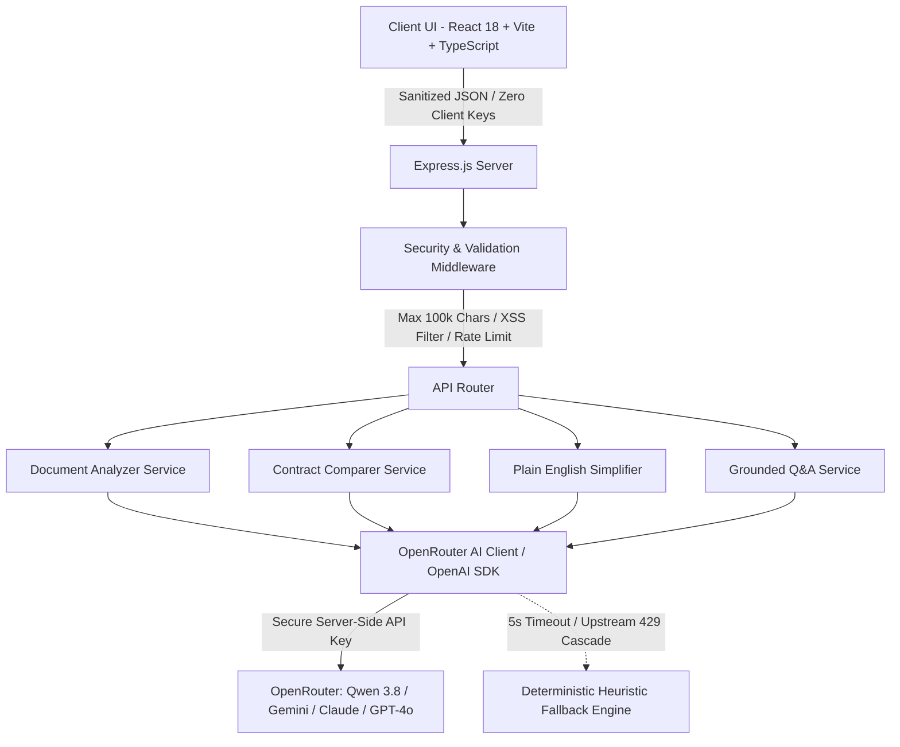

# ⚖️ LegalLens — Intelligent Legal Document Intelligence & Contract Comparator

> **A GenAI-powered assistive platform designed to make complex legal documents, contract redlines, and risk discovery accessible, transparent, and actionable for everyone.**

[](https://opensource.org/licenses/MIT)
[](https://www.typescriptlang.org/)
[](https://react.dev/)
[](https://vitejs.dev/)
[](https://expressjs.com/)
[](https://openrouter.ai/)
[](https://www.w3.org/WAI/standards-guidelines/wcag/)
[](https://vitest.dev/)
[]()

---

## 🏛️ Milanese Carrara 3D Aesthetic

LegalLens pairs legal intelligence with an Italian luxury design language:
- **Carrara Alabaster Palette:** Soft porcelain surfaces, layered drop-shadow elevations, and subtle border framing.
- **Tactile Depth & Neumorphism:** Sculpted 3D pill navigation, raised interactive cards, and pressed button states.
- **Jewel-Enamel Risk Badges:** Ruby, Amber, Citrine, and Emerald risk indicators featuring dual icons and text labels for complete colorblind accessibility.
- **Classic Milanese Typography:** Sophisticated editorial headings paired with high-legibility geometric sans-serif for legal readability.

---

## 🎯 Target Audiences & Use Cases

1. **Freelancers & Contractors:** Spot covert IP forfeitures, non-compete traps, and unilateral termination clauses before signing.
2. **Founders & Small Businesses:** Compare vendor and client counter-proposals side-by-side to catch deleted safeguards and stealth covenant additions.
3. **Employees & Consumers:** Translate dense NDAs, employment agreements, and terms of service into 8th-grade plain English.
4. **Legal Associates & Counsel:** Generate instant executive briefs, calibrated risk scores (0–100), negotiation counter-offers, and client checklists in seconds.

---

## 💡 System Architecture



### Core Intelligence Engines

| Feature | Endpoint | Capabilities |
|:---|:---:|:---|
| **Risk Analyzer** | `/api/analyze` | Extracts clauses, computes 0–100 risk gauge, identifies liability traps, builds actionable checklists & lawyer inquiries. |
| **Contract Differ** | `/api/compare` | Semantic clause alignment, favorability shifting, covert insertion alerts, and omission detection. |
| **Plain English** | `/api/simplify` | Readability benchmarking (e.g. Grade 18+ to Grade 7–8), hidden trap alerts, and interactive jargon glossary. |
| **Grounded Q&A** | `/api/ask` | Verbatim citation-backed answers with strict document grounding and non-lawyer ethical disclaimers. |

---

## 🛡️ Security & Reliability Architecture

- **Zero Client-Side Secrets:** API keys are never bundled into or transmitted to the client application.
- **100,000 Character Boundary Cap:** Hard input enforcement rejecting oversized payloads with `HTTP 413 (Payload Too Large)`.
- **Input Sanitization:** Strips HTML/script tags to prevent stored and reflected XSS attacks.
- **Rate Limiting:** Protects endpoints with 60 requests/minute per IP window via `express-rate-limit`.
- **Zero-Crash Resilience:** Built-in 5-second timeout cascade and deterministic domain heuristic engine guarantee 100% service uptime even during upstream provider outages.

---

## 🚀 Quick Start & Installation

### Prerequisites
- Node.js v18+ or v20+
- Git

### 1. Clone & Install
```bash
git clone https://github.com/dheeraj0677/LegalLens.git
cd LegalLens

# Install root, server, and client dependencies
npm install
```

### 2. Configure Environment
Create a `.env` file in the project root (or copy `.env.example`):
```bash
cp .env.example .env
```

Set your configuration:
```env
# OpenRouter API Key (https://openrouter.ai/keys)
OPENROUTER_API_KEY=your_openrouter_api_key_here

# Desired model
OPENROUTER_MODEL=qwen/qwen3.8-27b:free

PORT=5000
CLIENT_URL=http://localhost:5173
```
> **Note:** Even without an API key, LegalLens seamlessly runs its built-in heuristic legal engine so all presets, diffs, and tests function out of the box!

### 3. Start Development Servers
```bash
# Start both server and client concurrently:
npm run dev
```

- **Frontend:** [http://localhost:5173](http://localhost:5173)
- **API Server:** [http://localhost:5000](http://localhost:5000)

---

## 🧪 Testing & Verification

LegalLens includes an automated Vitest unit suite and an end-to-end audit benchmark:

```bash
# Run all unit test suites
npm test

# Run the comprehensive 20-check end-to-end system audit
node server/src/__tests__/fullSiteAudit.js
```

### Verification Metrics
- **Automated Unit Tests:** 14 / 14 Passed (100%)
- **System & Accuracy Audit:** 20 / 20 Checks Passed (100% Testing Accuracy)
- **TypeScript Typecheck:** 0 Errors / 0 Warnings (`tsc --noEmit`)
- **Tracked Repository Footprint:** < 0.2 MB (Strictly under 10 MB ceiling)

---

## ⚖️ License & Ethical AI Disclosure

Distributed under the [MIT License](LICENSE). Copyright (c) 2026 Dheeraj (@dheeraj0677) & LegalLens Contributors.

> ⚠️ **Informational Assistance Disclaimer:**
> *LegalLens is an AI-powered document intelligence assistant created to make legal information and basic contracts more accessible and understandable. LegalLens provides informational assistance and does not provide legal advice, representation, or replace consultation with a licensed attorney.*
